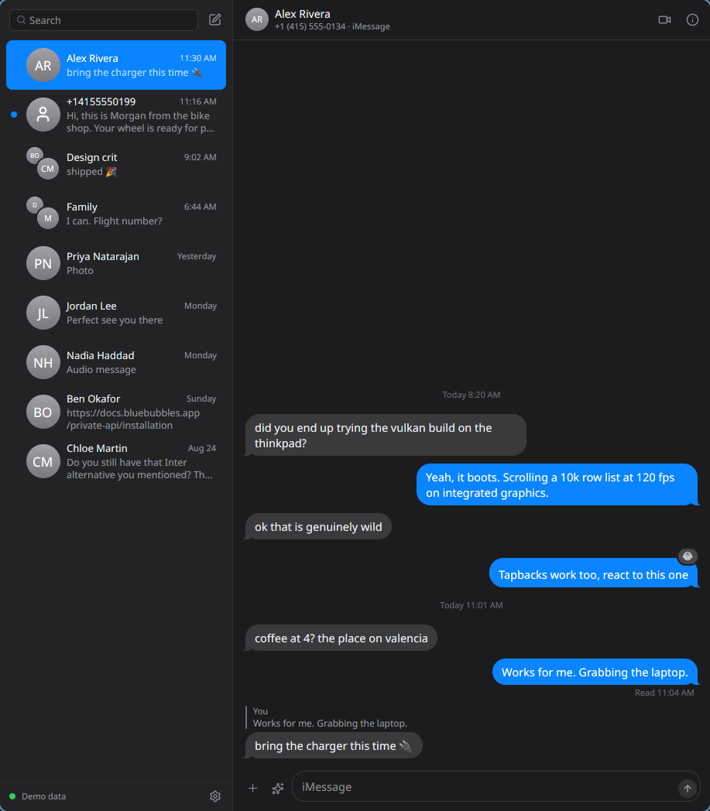
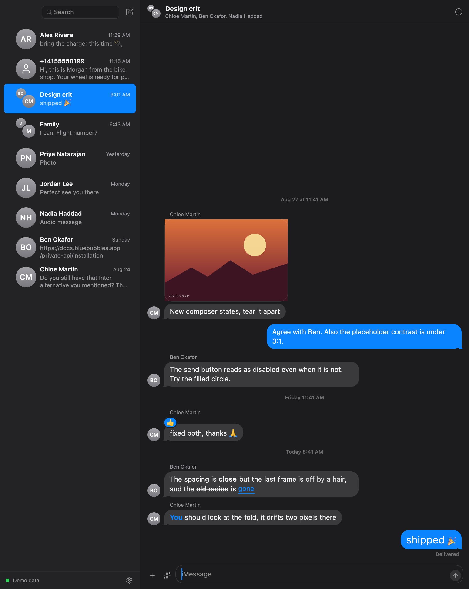
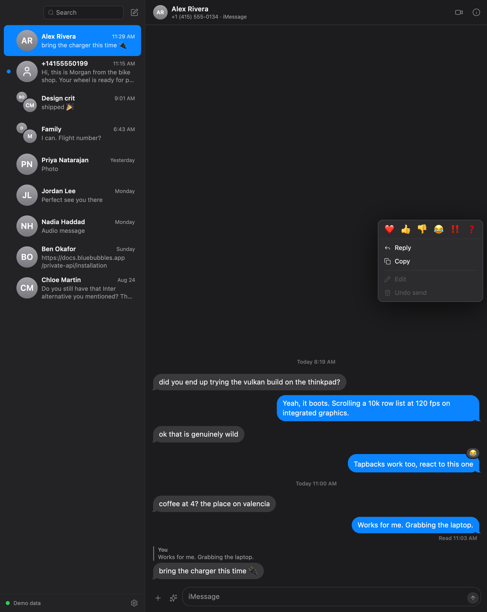

# Messages

iMessage on Linux, rendered on the GPU, with a Mac doing the talking to Apple.



This is a hobby project. It exists because I wanted iMessage on my Linux
laptop and the existing options felt like a bandaid: threads that only refresh
when you click away and back, and a UI that never quite looked like Messages.
So this one keeps a single in-memory store fed by the server's socket, sends
optimistically, and reconciles in the background. Switching chats is instant
because nothing is fetched on navigation.

## How it works

```
   Linux                              Mac (yours, SIP off for the good bits)
 ┌──────────────────┐   http + socket.io   ┌────────────────────────────────┐
 │ Messages (gpuix) │ ───────────────────▶ │ BlueBubbles server             │
 │ React on GPUI    │ ◀─────────────────── │  reads chat.db                 │
 │ Vulkan on Linux  │                      │  drives Messages.app           │
 └──────────────────┘                      │  Private API helper (SIP off)  │
                                           └────────────────────────────────┘
```

The Mac side is the open source [BlueBubbles server](https://github.com/BlueBubblesApp/bluebubbles-server).
It already does the hard part, including the Private API injection into
Messages.app that makes tapbacks, typing indicators, read receipts, replies,
edits and unsend possible. This repo is only the client. The backend half of
the client (`packages/core`) has no UI dependencies, so a bar widget or a TUI
can reuse it.

The window is drawn by [gpuix](https://github.com/remorses/gpuix), which is
React rendered natively by Zed's GPUI. No Electron, no web view, and a message
list that stays smooth with years of history because only visible rows exist.



Bubbles render what Messages puts in them: bold, strikethrough, underlined
links, mentions, the big and small text effects, photos between lines of text,
stickers, audio messages, videos, files and link previews. Right-click a bubble
for tapbacks, reply, copy, edit and unsend; double-click it for the tapback
picker.



## What works

| | Without Private API | With Private API (SIP disabled) |
|---|---|---|
| Read all conversations, groups, SMS and RCS | yes | yes |
| Send text and attachments, start new chats | yes | yes |
| Photos inline, files, audio messages, stickers | yes | yes |
| Link previews | yes | yes |
| Delivered and read status on your messages | yes | yes |
| Tapbacks (send and receive) | receive only | yes |
| Typing indicators, both directions | no | yes |
| Read receipts sent for you | no | yes |
| Replies in thread, edits, unsend | no | yes |
| Message effects (slam, confetti, and friends) | no | yes |
| Rename groups, add and remove people, leave | no | yes |
| Mark as unread, pin, mute | pin and mute | yes |
| Desktop notifications | yes | yes |
| Search across all messages | yes | yes |

The app asks the server what it can do and hides the rest, so a Mac with SIP
on still gives you a usable client.

## What does not work

FaceTime. BlueBubbles can answer an incoming FaceTime call on the Mac and turn
it into a FaceTime Link you open in a browser, but the server hangs up on its
own side 15 seconds later ([bluebubbles-helper#38](https://github.com/BlueBubblesApp/bluebubbles-helper/issues/38)),
and on macOS 26 the FaceTime helper does not inject at all
([bluebubbles-server#776](https://github.com/BlueBubblesApp/bluebubbles-server/issues/776)).
The client shows incoming calls and can create a FaceTime Link for a group
call, and that is as far as it goes until upstream moves.

Custom emoji tapbacks (the iOS 18 kind) show up when someone sends one, but
the server has no way to send them yet.

macOS 26 also broke the Messages.app helper for a while. Check the BlueBubbles
Private API status page in its settings; if it says the helper is not
connected, everything in the right column above is off.

## Install on Linux

You need [Bun](https://bun.sh) and a GPU with Vulkan. On NixOS you also need
Nix (obviously) because the prebuilt renderer wants a handful of system
libraries on `LD_LIBRARY_PATH`; `flake.nix` provides them.

```
git clone https://github.com/FormalSnake/messages ~/Developer/messages
cd ~/Developer/messages
./scripts/install-linux.sh
```

That installs a `messages` command in `~/.local/bin` and a desktop entry, so
it shows up in your launcher. On other distros install `libxkbcommon`,
`wayland`, `vulkan-loader`, `fontconfig` and `freetype` from your package
manager, then `bun install && bun run dev`.

First launch opens the connect screen. Paste the server address and password
from BlueBubbles on the Mac. Tailscale works well for this; the app has been
developed against a Mac on the other side of a tailnet.

`MESSAGES_DEMO=1 messages` runs on built-in fixtures with no Mac at all, which
is how the screenshots were made.

## On the Mac

1. Install the BlueBubbles server and give it Full Disk Access.
2. Turn off "Encrypt communications" in its settings. The client speaks plain
   JSON to it; put it behind Tailscale or a VPN instead.
3. For the right column of the table above: disable SIP, turn on Private API
   in BlueBubbles, and wait for "helper connected". The BlueBubbles docs
   explain the SIP dance for your macOS version.

## Hacking on it

```
bun install
bun run demo        # window on fixtures
bun run dev         # window against ~/.config/messages/config.json
bun run test        # mapper tests, then GPU-backed app tests (macOS only for now)
bun run typecheck
```

`packages/core` is the backend: types, the `Transport` interface, the
BlueBubbles client, the store, the demo fixtures. `apps/desktop` is the
window. `CLAUDE.md` has the details that bit me while building it, including
the gpuix rules.

## License

MIT.
