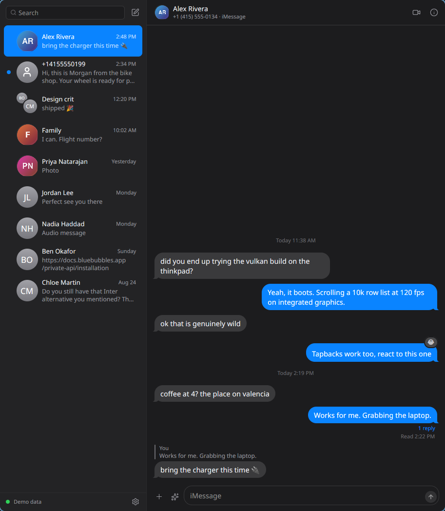
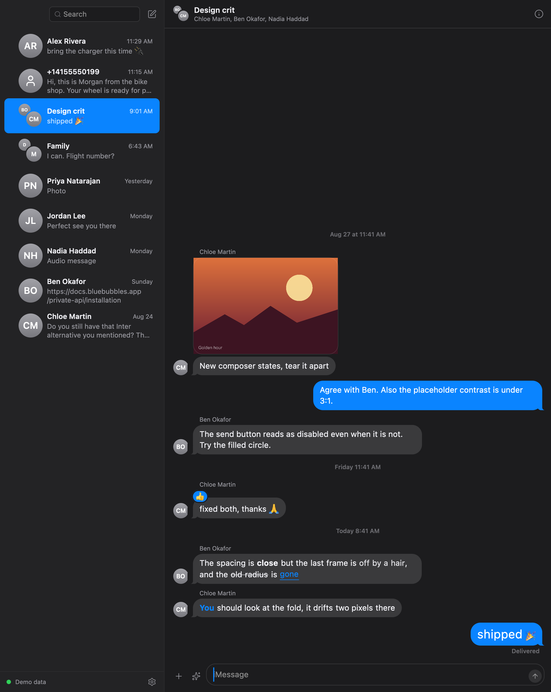
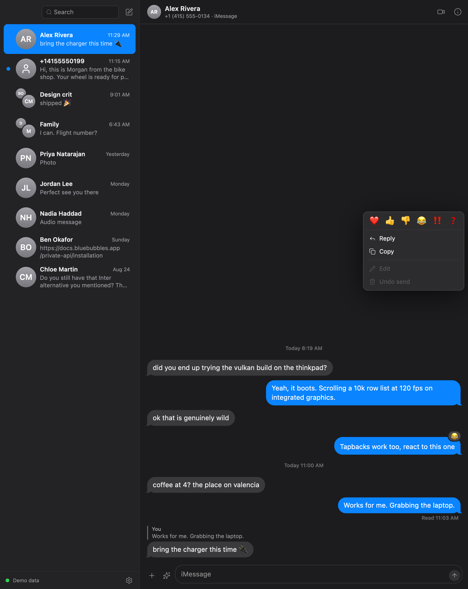

# Messages

iMessage on Linux, rendered on the GPU, with a Mac doing the talking to Apple.



This is a hobby project. It exists because I wanted iMessage on my Linux
laptop and the existing options felt like a bandaid: threads that only refresh
when you click away and back, and a UI that never quite looked like Messages.
So this one keeps a single in-memory store fed by the server's socket, sends
optimistically, and reconciles in the background. Switching chats is instant
because nothing is fetched on navigation, and the window opens on the last
known state from disk while the server catches up.

## How it works

```
   Linux                              Mac (yours, SIP off for the good bits)
 ┌──────────────────┐   http + socket.io   ┌────────────────────────────────┐
 │ Messages (Rust)  │ ───────────────────▶ │ BlueBubbles server             │
 │ GPUI + gpui-kit  │ ◀─────────────────── │  reads chat.db                 │
 │ Vulkan on Linux  │                      │  drives Messages.app           │
 └──────────────────┘                      │  Private API helper (SIP off)  │
                                           └────────────────────────────────┘
```

The Mac side is the open source [BlueBubbles server](https://github.com/BlueBubblesApp/bluebubbles-server).
It already does the hard part, including the Private API injection into
Messages.app that makes tapbacks, typing indicators, read receipts, replies,
edits and unsend possible. This repo is only the client. The backend half of
the client (`crates/core`) has no UI dependencies, so a bar widget or a TUI
can reuse it.

The window is drawn by Zed's [GPUI](https://www.gpui.rs) with
[gpui-kit](https://gpui-kit.com) components, all in Rust. No Electron, no web
view, no JavaScript runtime. A store event redraws only the row, bubble or
header it touches, so the window idles at 0% CPU, and the message list stays
smooth with years of history because only visible rows exist. It runs on
Linux (GNOME and Hyprland on Wayland), Windows and macOS.



Bubbles render what Messages puts in them: bold, strikethrough, underlined
links, mentions, the big and small text effects, photos between lines of text,
stickers, audio messages, videos, files and link previews. Right-click a bubble
for tapbacks, reply, copy, edit and unsend; double-click it for the tapback
picker.



## What works

| | Without Private API | With Private API (SIP disabled) |
|---|---|---|
| Read all conversations, groups, SMS and RCS | yes | yes |
| Send text and attachments, start new chats | yes | yes |
| Photos inline, files, audio messages, stickers | yes | yes |
| Link previews | yes | yes |
| Delivered and read status on your messages | yes | yes |
| Tapbacks (send and receive) | receive only | yes |
| Typing indicators, both directions | no | yes |
| Read receipts sent for you | no | yes |
| Replies in thread, edits, unsend | no | yes |
| Message effects (slam, confetti, and friends) | no | yes |
| Rename groups, add and remove people, leave | no | yes |
| Mark as unread, pin, mute | pin and mute | yes |
| Read without receipts, per chat | yes | yes |
| Draft sync between clients | yes | yes |
| Export a conversation to Markdown | yes | yes |
| Desktop notifications | yes | yes |
| Search across all messages | yes | yes |
| Scheduled sends | yes | yes |

The sidebar search box takes a small query language on top of plain text:
`from:name` or `from:me`, `has:photo`, `has:video`, `has:file`, `has:link`,
`before:2024-01-15`, `after:2024-01-15`, and `in:chat name`, any combination
of them alongside free text. A name in `from:` or `in:` can be quoted to keep
its spaces (`from:"Priya Natarajan"`). Clicking a result opens the
conversation and scrolls to that message, paging in older history if it
is not loaded yet.

The app asks the server what it can do and hides the rest, so a Mac with SIP
on still gives you a usable client.

### Keyboard

- `Ctrl+N`: new message
- `Ctrl+F`: focus search
- `Ctrl+K`: jump to a conversation
- `Ctrl+I`: toggle conversation details
- `Ctrl+[` and `Ctrl+]`: step to the previous or next conversation
- `Ctrl+1` to `Ctrl+6`: tapback the other side's last message (love, like, dislike, laugh, emphasize, question)
- `Shift+Ctrl+U`: mark the conversation unread

Use `Cmd` in place of `Ctrl` on macOS.

Right-click the send button to schedule a message for later; the BlueBubbles
server holds it and sends it at the scheduled time, so it still goes out once
the client is closed. Pending sends for the open conversation show as rows
above the composer, each with a cancel button.

## What does not work

FaceTime. BlueBubbles can answer an incoming FaceTime call on the Mac and turn
it into a FaceTime Link you open in a browser, but the server hangs up on its
own side 15 seconds later ([bluebubbles-helper#38](https://github.com/BlueBubblesApp/bluebubbles-helper/issues/38)),
and on macOS 26 the FaceTime helper does not inject at all
([bluebubbles-server#776](https://github.com/BlueBubblesApp/bluebubbles-server/issues/776)).
The client shows incoming calls and can create a FaceTime Link for a group
call, and that is as far as it goes until upstream moves.

Custom emoji tapbacks (the iOS 18 kind) show up when someone sends one, but
the server has no way to send them yet.

Editing a sent message on a Mac running macOS 26: the BlueBubbles helper calls
an `IMChat` method Apple renamed, Messages.app crashes and the Private API is
gone for half a minute. The client hides Edit on macOS 26 until that is fixed
upstream. Unsend and tapbacks work.

macOS 26 also broke the Messages.app helper for a while. Check the BlueBubbles
Private API status page in its settings; if it says the helper is not
connected, everything in the right column above is off.

## Find My locations on contact cards

BlueBubbles' Find My endpoints return nothing on current macOS because Apple
encrypts the Find My caches since macOS 14.4. This repo ships a small agent
that runs on the Mac (`apps/mac-agent`), decrypts them the way
[findmy-cache-decryptor](https://github.com/PnutCN/findmy-cache-decryptor) and
[FindMySyncPlus](https://github.com/manonstreet/FindMySyncPlus) worked out, and
serves the people sharing their location with you. The details panel then shows
an Apple Maps snapshot (rendered on the Mac by MapKit, `GET /findmy/snapshot`),
the place and when it was updated, under each participant; clicking the map
opens Apple Maps on a Mac and Google Maps elsewhere.

Those caches only move while FindMy.app is running, and only for the first few
minutes after it launches, so the agent keeps the app open hidden and restarts
it whenever the files stop changing. Set `"keepFindMyOpen": false` in
`~/.config/messages/agent.json` to leave the app alone, at the price of
locations that go stale within the hour. Changes are pushed to the client as
they land on disk, over `GET /findmy/stream`, so an open details panel follows
someone in something close to real time.

You need the three Find My keys once. They come out of the Mac with
[findmy-key-extractor](https://github.com/manonstreet/findmy-key-extractor),
which attaches a debugger to Find My, so besides SIP off it wants
`sudo nvram boot-args="amfi_get_out_of_my_way=1"` and a reboot. After that
reboot, `scripts/findmy-keys-mac.sh` runs the extractor, installs the keys into
`~/.config/messages/findmy/` and restarts the agent
(`scripts/install-mac-agent.sh` installs the agent itself). Then add the
agent's address and token to the client config:

```json
{ "agent": { "url": "http://your-mac:1236", "token": "…from ~/.config/messages/agent.json" } }
```

Keys survive reboots, so you can put the boot argument back afterwards.

The same agent syncs pins and muted chats between every client pointed at
it, and shows the conversations you pinned in Messages.app on the Mac as
pinned here too. Unpinning one of those in the client sticks until you pin
it again on the Mac.

## Colours

The app ships Apple's dark palette. Drop a flat JSON of palette tokens at
`~/.config/messages/theme.json` to override any of them; the file is polled
every second, so a wallpaper-driven generator such as matugen can rewrite
it and the window recolours in place. The token names are the fields of
`Palette` in `crates/desktop/src/theme.rs`; give `accent`, `danger`, `text` and the
surfaces and the rest is derived.

```json
{ "canvas": "#1c1917", "sidebar": "#232020", "text": "#b4bdc3", "accent": "#6099c0" }
```

## GIFs

The composer's GIF button searches [Klipy](https://klipy.com), a free GIF
API. Create an app key at [partner.klipy.com](https://partner.klipy.com/)
(API Keys) and add it to the client config:

```json
{ "klipy": { "apiKey": "…from partner.klipy.com" } }
```

A key in Testing mode is capped at 100 requests/hour; request Production
access in the same panel once you're done testing. The button only appears
once `klipy` is set.

The heart on each tile favorites a GIF; a Favorites row appears above
trending GIFs when the search box is empty, works offline once its preview is
cached, and syncs across clients through the Mac agent alongside pinned chats.

## Assistant

Three buttons run a message through your own [CanaryLLM](https://canaryllm.canarycoders.es)
gateway, when it is configured:

```json
{ "canaryllm": { "apiKey": "…", "model": "gemini/gemini-2.5-flash-lite", "language": "Spanish" } }
```

`apiKey` is required (or set `MESSAGES_CANARYLLM_KEY`); `model` and `language`
are optional and default to a cheap Gemini flash-lite model and the system
locale's language.

- **Catch me up**, the sparkle in the conversation header, summarizes the
  messages since your last one in the thread (or the last 50).
- **Translate**, in a bubble's right-click menu, translates it to `language`
  and shows the result under the bubble; a second click hides it.
- **Transcribe**, under an audio message, shows its transcript.

Every button is a click, never automatic: nothing runs on a timer or on an
incoming message, and no attachment bytes ever leave the machine, only text,
sender name and time. Nothing is sent to anyone; the gateway only reads what
you ask it to.

## Install on Linux

You need a Rust toolchain (edition 2024, so 1.85 or newer) and a GPU with
Vulkan. `ffmpeg` on `PATH` is
optional: without it a video is a dark box with a play button instead of a
poster frame, and the tiles of a photo grid letterbox the whole picture
instead of filling their box. On NixOS the installer builds inside
`flake.nix`'s dev shell, which also provides the system libraries the window
loads at runtime.

```
git clone https://github.com/FormalSnake/messages ~/Developer/messages
cd ~/Developer/messages
./scripts/install-linux.sh
```

That builds a release binary and installs a `messages` command in
`~/.local/bin`, a desktop entry and the icon, so it shows up in your launcher
and the dock groups the window under it. On other distros install
`libxkbcommon`, `wayland`, `vulkan-loader`, `fontconfig` and `freetype` from
your package manager first; the same script works without Nix.

On Windows, install [rustup](https://rustup.rs) and the Visual Studio C++
build tools, then `cargo run --release -p messages` from the clone.

First launch opens the connect screen. Paste the server address and password
from BlueBubbles on the Mac. Tailscale works well for this; the app has been
developed against a Mac on the other side of a tailnet.

`MESSAGES_DEMO=1 messages` runs on built-in fixtures with no Mac at all, which
is how the screenshots were made.

### A second Linux box

Everything past the server address lives in `~/.config/messages/config.json`,
which is per machine and never travels on its own. Run the installer on the
new box, then copy the file across:

```
scp othermachine:~/.config/messages/config.json ~/.config/messages/config.json
```

Skip that and the app still connects, but the optional halves go quiet with no
error: no pinned chats or Find My from the Mac (`agent`), no GIF button
(`klipy`), no assistant (`canaryllm`). The sections above say what each key
holds. Pins, mutes and GIF favorites sync themselves through the agent once
it is configured, so only the file itself has to travel.

### Autostart

The desktop entry is enough for a launcher. To bring the app up with the
session, point a systemd user unit at the same launcher:

```ini
# ~/.config/systemd/user/messages.service
[Unit]
Description=Messages
PartOf=graphical-session.target
After=graphical-session.target

[Service]
ExecStart=%h/.local/bin/messages

[Install]
WantedBy=graphical-session.target
```

Then `systemctl --user enable messages.service`. When no window appears,
`journalctl --user -u messages` has the renderer's output; a missing system
library shows up there as a dlopen failure.

## On the Mac

1. Install the BlueBubbles server and give it Full Disk Access.
2. Turn off "Encrypt communications" in its settings. The client speaks plain
   JSON to it; put it behind Tailscale or a VPN instead.
3. For the right column of the table above: disable SIP, turn on Private API
   in BlueBubbles, and wait for "helper connected". The BlueBubbles docs
   explain the SIP dance for your macOS version.

## Hacking on it

```
MESSAGES_DEMO=1 cargo run --release -p messages   # window on fixtures
cargo run --release -p messages                   # window against ~/.config/messages/config.json
cargo test --workspace                            # core tests, then GPUI app tests on the fixtures
scripts/screenshot.sh                             # screenshots/messages.png from the fixtures
```

`crates/core` is the backend: types, the `Transport` trait, the BlueBubbles
client, the store, the demo fixtures. `crates/desktop` is the window.
`apps/mac-agent` is the TypeScript agent that runs on the Mac (`bun run
agent`). `CLAUDE.md` has the details that bit me while building it, including
the GPUI rules.

## License

MIT.
