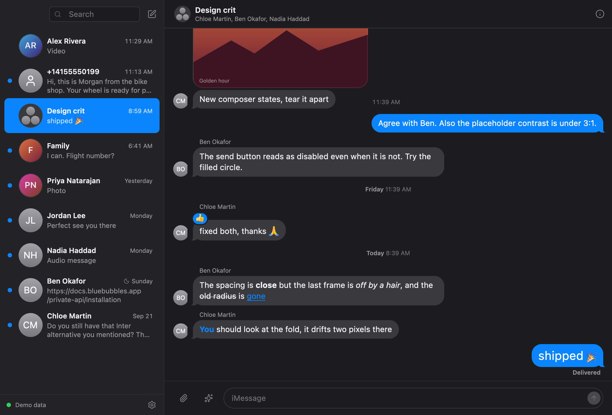
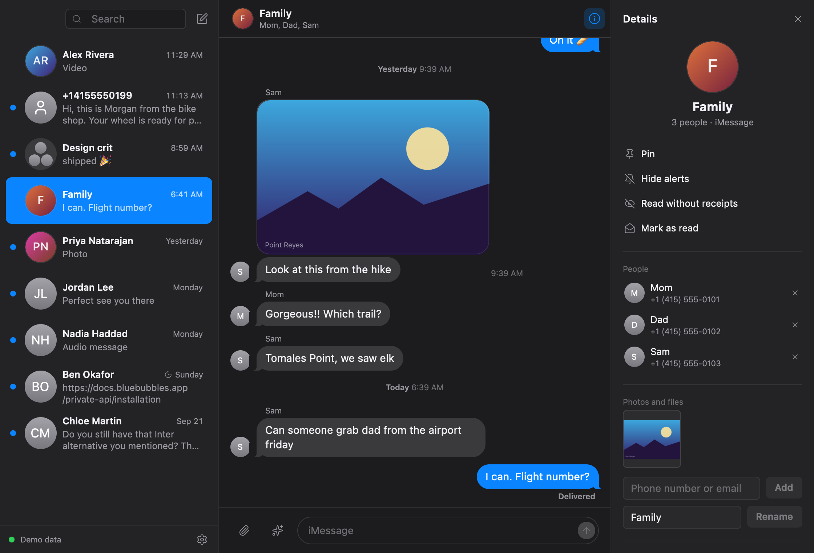
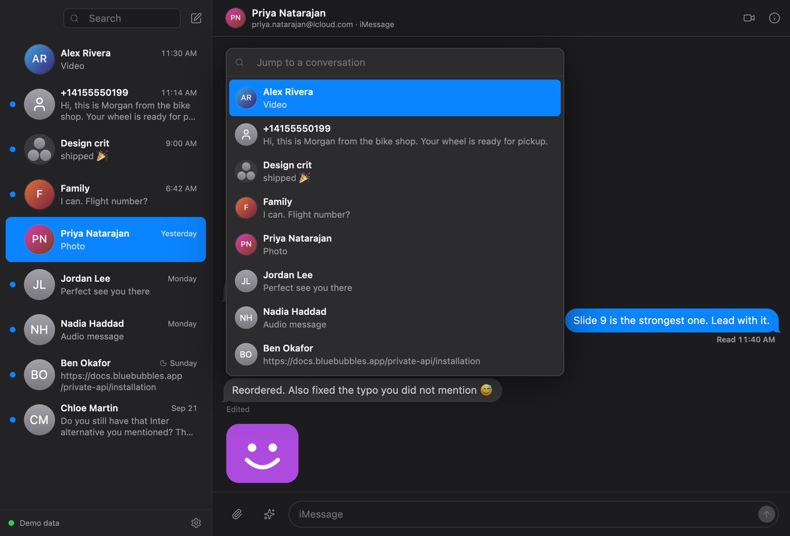

<p align="center"></p>

# Messages

iMessage on Linux. A native Rust client (GPUI) that talks to a
[BlueBubbles server](https://github.com/BlueBubblesApp/bluebubbles-server)
running on your Mac.



```
 Linux / Windows                        Mac
┌──────────────────┐  http + socket.io  ┌──────────────────────────────┐
│ Messages (Rust)  │ ─────────────────▶ │ BlueBubbles server           │
│ GPUI, Vulkan     │ ◀───────────────── │ reads chat.db, drives        │
└──────────────────┘                    │ Messages.app (Private API)   │
                                        └──────────────────────────────┘
```

Threads update live, sends are optimistic and queue while offline, and the
window opens on the last known state before the server answers. It idles at
0% CPU.

| | |
|---|---|
|  |  |

## Features

| | SIP on | Private API (SIP off) |
|---|---|---|
| Read and send text, photos, files, audio, stickers, link previews | yes | yes |
| Search with `from:`, `has:`, `before:`, `after:`, `in:` | yes | yes |
| Scheduled sends, notifications, Markdown export | yes | yes |
| Pin, mute, draft sync between clients | yes | yes |
| Tapbacks | receive | yes |
| Typing indicators, read receipts, replies, unsend, effects | no | yes |
| Rename groups, add and remove people | no | yes |

Optional extras: Find My locations on contact cards (needs the Mac agent),
GIF search through [Klipy](https://klipy.com), and summarize/translate/transcribe
through a [CanaryLLM](https://canaryllm.canarycoders.es) gateway.

Not working: FaceTime (upstream
[helper#38](https://github.com/BlueBubblesApp/bluebubbles-helper/issues/38),
[server#776](https://github.com/BlueBubblesApp/bluebubbles-server/issues/776)),
sending custom emoji tapbacks, and editing on macOS 26 (hidden until the
helper is fixed).

## Install

### Nix

```
nix run github:FormalSnake/messages
```

Home Manager:

```nix
{
  inputs.messages = {
    url = "github:FormalSnake/messages";
    inputs.nixpkgs.follows = "nixpkgs";
  };

  # in your home-manager configuration
  imports = [ inputs.messages.homeModules.default ];

  programs.messages = {
    enable = true;
    autostart = true;                             # start with the graphical session
    environmentFile = "/run/agenix/messages.env"; # optional, server password etc.
    theme = { accent = "#6099c0"; };              # optional, writes theme.json
  };
}
```

This installs the app, its desktop entry and icon. `overlays.default` adds
`pkgs.messages`.

### Other Linux

Needs Rust 1.89+, Vulkan, and `libxkbcommon`, `wayland`, `vulkan-loader`,
`fontconfig`, `freetype`, `alsa-lib`. `ffmpeg` is optional (video posters,
playback).

```
git clone https://github.com/FormalSnake/messages
cd messages
./scripts/install-linux.sh
```

This installs `~/.local/bin/messages` and a desktop entry.

### Windows

Install [rustup](https://rustup.rs) and the Visual Studio C++ build tools, then
`cargo run --release -p messages`.

## Mac setup

1. Install the BlueBubbles server and give it Full Disk Access.
2. Turn off "Encrypt communications". Reach the Mac over Tailscale or a VPN.
3. For the Private API column: disable SIP and turn on Private API in
   BlueBubbles.

On first launch, paste the server address and password. `MESSAGES_DEMO=1
messages` runs on fixtures with no Mac.

## Configuration

`~/.config/messages/config.json` (the app writes the server part itself):

```json
{
  "agent": { "url": "http://your-mac:1236", "token": "..." },
  "klipy": { "apiKey": "..." },
  "canaryllm": { "apiKey": "...", "model": "gemini/gemini-2.5-flash-lite", "language": "Spanish" }
}
```

Environment overrides: `MESSAGES_SERVER_URL` + `MESSAGES_SERVER_PASSWORD`,
`MESSAGES_AGENT_URL` + `MESSAGES_AGENT_TOKEN`, `MESSAGES_KLIPY_KEY`,
`MESSAGES_CANARYLLM_KEY`, `MESSAGES_FONT`.

`~/.config/messages/theme.json` overrides palette tokens (fields of `Palette`
in `crates/desktop/src/theme.rs`) and is reloaded live, so matugen can drive it:

```json
{ "canvas": "#1c1917", "text": "#b4bdc3", "accent": "#6099c0" }
```

### Mac agent

`apps/mac-agent` runs on the Mac and adds Find My locations, Apple Maps
snapshots, and pins, mutes and GIF favorites synced across clients.

1. `apps/mac-agent/scripts/install-mac-agent.sh` installs it as a launchd agent
   (port 1236, token in `~/.config/messages/agent.json`).
2. For Find My: boot with SIP off and
   `sudo nvram boot-args="amfi_get_out_of_my_way=1"`, then run
   `scripts/findmy-keys-mac.sh` once to extract the keys.
3. Add `agent` to the client config as above.

## Keyboard

| | |
|---|---|
| `Ctrl+N` | new message |
| `Ctrl+F` | search |
| `Ctrl+K` | jump to a conversation |
| `Ctrl+I` | conversation details |
| `Ctrl+[` / `Ctrl+]` | previous / next conversation |
| `Ctrl+1` to `Ctrl+6` | tapback the last message |
| `Shift+Ctrl+U` | mark unread |

`Cmd` on macOS. Right-click the send button to schedule a message.

## Development

```
MESSAGES_DEMO=1 cargo run --release -p messages   # fixtures
cargo test --workspace
nix build .#messages                              # Linux package
bun run agent                                     # the Mac agent
```

`crates/core` is the store, transport and BlueBubbles client with no UI
dependencies. `crates/desktop` is the window. `CLAUDE.md` has the
architecture notes.

## License

[MIT](LICENSE). The Noto Sans faces in `packaging/fonts` are under the
[OFL](packaging/fonts/OFL.txt).
